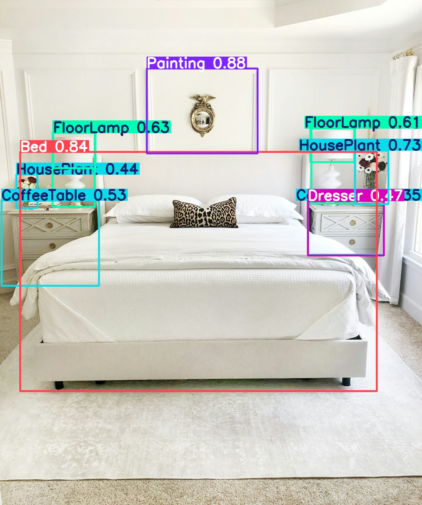
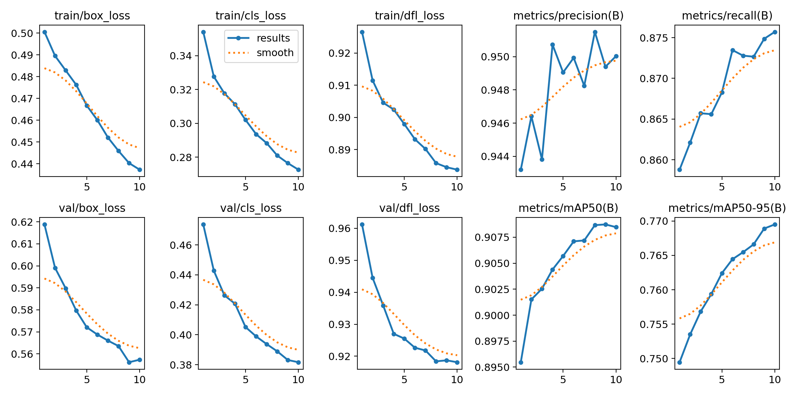
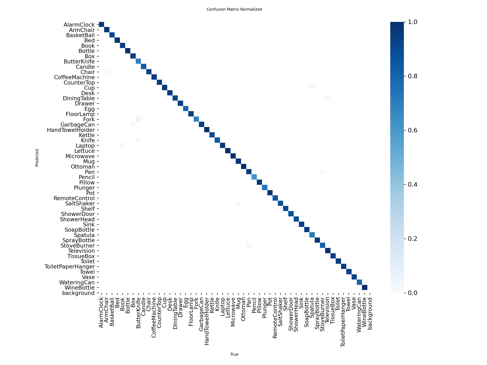
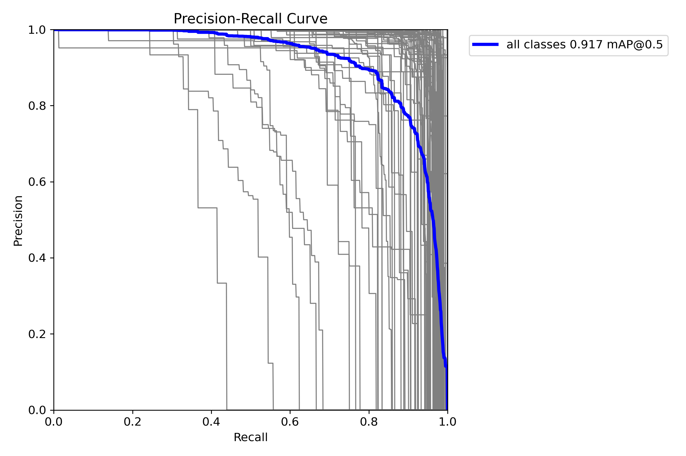

# MoveVision AI: Smart Household Inventory and Relocation Estimator

MoveVision AI is an AI-powered computer vision application that detects household items from room photos or videos, converts the detections into an editable moving inventory, estimates total volume and weight, recommends a suitable truck, and generates a relocation cost report.

The project was built as an end-to-end applied AI system rather than only a model demo. It combines object detection, custom class mapping, inventory estimation, quote calculation, manual review, and PDF report generation inside a Streamlit interface.

## Problem Statement

Moving companies usually need a manual survey to estimate household inventory, truck size, packing material, labor, and approximate relocation cost. This process is slow, inconsistent, and dependent on human inspection.

MoveVision AI attempts to automate the first layer of this workflow by allowing a user to upload room images or videos and receive:

- Detected household item counts
- Room-wise editable inventory
- Confidence review for uncertain detections
- Estimated volume and weight
- Recommended truck size
- Cost estimate with packing, loading, distance, floor, and box charges
- Downloadable PDF report

## Key Features

- Fine-tuned YOLO-based household object detection model
- Image and video support for room scanning
- ByteTrack-based object tracking for video inputs
- Duplicate suppression for image detections
- Room-wise inventory grouping
- Human-in-the-loop correction using editable Streamlit tables
- Confidence review labels: High, Review, and Low
- Volume and weight estimation using item metadata
- Truck recommendation based on total volume buffer
- Relocation quote calculation using route, floor, lift, fragile items, boxes, and packing cost
- PDF estimate report generation
- Packing tips for fragile and high-care items

## Screenshots

### Detection Output



### Training History



### Living Room Detection Output


## Tech Stack

| Area | Tools and Libraries |
| --- | --- |
| Programming Language | Python |
| UI | Streamlit |
| Object Detection | Ultralytics YOLO |
| Video Tracking | ByteTrack |
| Computer Vision | OpenCV |
| Model Inference | PyTorch, CUDA |
| Data Handling | Pandas, NumPy |
| Report Generation | FPDF |
| Training Utilities | Custom dataset merge, pruning, fine-tuning scripts |
| Development Environment | Windows, PyCharm |

## Project Workflow

1. User uploads one or more room images or videos.
2. The app assigns each uploaded file to a room such as Bedroom, Living Room, Kitchen, or Office.
3. The YOLO model detects household objects in each image or sampled video frame.
4. Detector labels are normalized into inventory labels using a controlled class mapping.
5. Duplicate detections are reduced for images; video detections use ByteTrack tracking IDs.
6. Each detected item receives a confidence summary.
7. The user reviews and edits the generated room-wise inventory.
8. The estimator calculates total volume, total weight, fragile count, and truck requirement.
9. The quote engine generates a relocation cost range.
10. The app exports a PDF report containing inventory, quote, packing tips, and terms.

## Model Training Summary

The project started with a general YOLOv8 nano model, but it was not accurate enough for indoor household scenes. The first tests showed weak detections on standard room photos, where common objects such as lamps, tables, plants, and TVs were missed.

To improve this, the project moved through multiple model stages:

- Baseline testing with `yolov8n.pt`
- Accuracy improvement by switching to a larger YOLO model
- Fine-tuning on household-object datasets
- Merging and pruning dataset classes to focus on movable household inventory
- Final inference model configured as `weights/household_v2_best.pt`
- Estimator classes aligned with detector-supported classes to avoid calculating items the model cannot detect

The final model is used through `detector.py`, while `estimator.py` maps raw model labels such as `FloorLamp`, `DeskLamp`, `Sofa`, `Television`, and `HousePlant` into practical inventory names such as `lamp`, `sofa`, `tv`, and `potted plant`.

## Model Evaluation

Full evaluation report with per-class breakdown, curves, and methodology: **[evaluation/README.md](evaluation/README.md)**

### Key Metrics

| Metric | Score |
|--------|-------|
| mAP@50 | 91.7% |
| mAP@50-95 | 78.4% |
| Precision | 95.3% |
| Recall | 88.8% |
| Classes above 0.5 AP | 94 / 101 |

### Before vs After Fine-Tuning

| Metric | v1 (COCO pretrained) | v2 (+ real-world fine-tune) |
|--------|---------------------|----------------------------|
| mAP@50 | 91.4% | 90.8% |
| mAP@50-95 | 77.1% | 77.0% |
| Precision | 95.4% | 95.0% |
| Recall | 88.8% | 87.6% |

The v2 model trades a small decrease in synthetic test-set metrics for significantly better generalization on real room photos.

### Confusion Matrix



### Precision-Recall Curve



## Estimation Logic

The estimator uses a lookup table for supported household items. Each item has:

- Approximate volume in cubic feet
- Approximate weight in kilograms
- Fragility category
- Household category

The quote engine uses the combined inventory summary to calculate:

- Total volume
- Total weight
- Fragile item count
- Recommended truck
- Base truck cost
- Distance-based transport cost
- Packing material cost
- Loading and unloading cost
- Floor surcharge when lift is unavailable
- Extra box cost
- Minimum, best, and maximum estimate range

Truck selection is based on volume with a buffer, so the recommended vehicle is not selected only on exact object volume.

## Limitations Faced

This project intentionally includes a review workflow because household object detection is not perfect in real-world scenes.

Main limitations observed during development:

- NumPy 2.x caused compatibility issues with Ultralytics and OpenCV during setup, so the environment was stabilized using NumPy 1.26.4 and OpenCV 4.9.0.
- CUDA-enabled PyTorch had to be installed carefully so inference could use the NVIDIA GPU instead of running slowly on CPU.
- General YOLO models detected only common COCO-style objects and missed many household-specific items.
- The first nano model was too weak for complex indoor scenes.
- Lamps, small decor, plants, side tables, and partially visible objects were often missed or confused.
- Low light, clutter, occlusion, unusual camera angles, and small object size reduced detection accuracy.
- Some visually similar items were confused, such as table-like furniture or lamp-like objects.
- Datasets contained classes that were not useful for relocation, such as fixed room parts or tiny non-moving objects.
- The estimator originally had more item classes than the detector could recognize, so the class list had to be aligned.
- Video detection can still over-count or under-count if the camera moves quickly or revisits the same room area.
- Volume and weight values are estimates, not exact measurements.
- The final moving quote is an approximate planning estimate and should be verified by a physical survey before real billing.
- PDF generation initially failed for symbols like rupee signs and arrows because FPDF core fonts do not support all Unicode characters; this was fixed using text sanitization.

## Why Confidence Review Was Added

Instead of hiding model uncertainty, the app exposes it. Each detected item type is marked as:

- `High`: detection is likely reliable
- `Review`: user should verify the item and count
- `Low`: detection is weak and should be checked carefully

This makes the system more realistic for a production-style workflow because users can correct AI output before generating the final estimate.

## Setup Instructions

### 1. Clone the Repository

```bash
git clone <your-repository-url>
cd "AI HOUSEHOLD"
```

### 2. Create a Virtual Environment

```bash
python -m venv .venv
```

On Windows:

```bash
.venv\Scripts\activate
```

### 3. Install Dependencies

```bash
pip install streamlit ultralytics pandas fpdf
pip install numpy==1.26.4 opencv-python==4.9.0.80
```

Install PyTorch based on your system. For NVIDIA GPU support, use the CUDA command from the official PyTorch installation page.

### 4. Add Model Weights

Place the trained model inside:

```text
weights/household_v2_best.pt
```

### 5. Run the Application

```bash
streamlit run app.py
```

The app will start locally, usually at:

```text
http://localhost:8501
```

## Deployment Notes

The project is prepared for Linux cloud deployment with CPU inference. Model weights are not committed to GitHub. Before deploying, provide the model in one of two ways:

- Place `household_v2_best.pt` at `weights/household_v2_best.pt`
- Set `MOVEVISION_MODEL_URL` to a direct download URL so the app can download weights on startup

### Streamlit / Hugging Face Spaces

The repository includes Hugging Face Spaces metadata in this README and uses `app.py` as the Streamlit entry point.

### Docker

```bash
docker build -t movevision-ai .
docker run -p 7860:7860 -e MOVEVISION_MODEL_URL="<model-download-url>" movevision-ai
```

### FastAPI

```bash
uvicorn fastapi_server:app --host 0.0.0.0 --port 8000
```

API endpoints:

- `GET /health`
- `POST /estimate`

## Important Files

| File | Purpose |
| --- | --- |
| `app.py` | Streamlit UI, upload flow, editable inventory, estimate view, PDF export |
| `detector.py` | YOLO image/video detection, tracking, duplicate suppression, confidence summary |
| `estimator.py` | Item metadata, class mapping, volume and weight calculation, truck recommendation |
| `quote.py` | Relocation quote calculation logic |
| `pricing_config.yaml` | Editable pricing, truck, box, surcharge, and distance configuration |
| `pricing.py` | Pricing config loader with fallback defaults |
| `correction_logger.py` | Human correction logger for future retraining data |
| `fastapi_server.py` | API wrapper exposing image-to-estimate inference |
| `report_generator.py` | ReportLab PDF report generator |
| `train.py` | Model training script |
| `train_pruned.py` | Training script for pruned household classes |
| `merge_datasets.py` | Dataset merge utility |
| `prune_dataset.py` | Dataset pruning utility |
| `eval.py` | Evaluation utility |
| `weights/household_v2_best.pt` | Final fine-tuned model used for inference |

## Future Scope

- Add correction logging so manually edited inventory can be saved as feedback data for future training.
- Add a validation dashboard showing precision, recall, mAP, and per-class performance.
- Improve the dataset with more indoor room images and more examples of small household objects.
- Add instance segmentation for better object boundaries and duplicate handling.
- Add OCR or barcode support for packed boxes and labels.
- Add cloud storage for uploaded scans and generated reports.
- Add user accounts for saving multiple move estimates.
- Add region-wise pricing rules for different cities and vendors.
- Export reports in both PDF and Excel formats.
- Deploy the app on a cloud platform with GPU-backed inference.

## Resume Highlight

Built MoveVision AI, an end-to-end computer vision relocation estimator using YOLO, OpenCV, PyTorch, Streamlit, and FPDF. Fine-tuned a household object detector, aligned model classes with a volume and weight estimator, added confidence-based human review, and generated truck recommendations and PDF moving cost reports from room images and videos.
