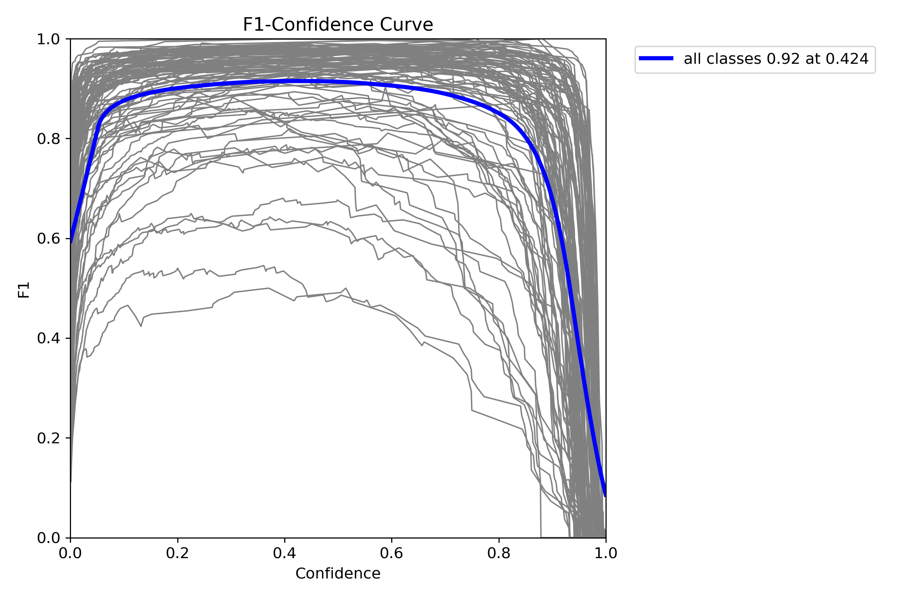

# Model Evaluation Report

This document presents the evaluation results for MoveVision AI's household object detection model (`household_v2_best.pt`).

## Model Summary

| Property | Value |
|----------|-------|
| Architecture | YOLOv8x |
| Parameters | 43.7M |
| GFLOPs | 165.2 |
| Classes | 101 |
| Inference size | 640px (eval) / 960px (app) |
| Test images | 971 |
| Test annotations | 13,147 |

## Overall Metrics

| Metric | Score | Verdict |
|--------|-------|---------|
| **mAP@50** | **91.7%** | Excellent |
| **mAP@50-95** | **78.4%** | Very good |
| **Precision** | **95.3%** | Almost no false positives |
| **Recall** | **88.8%** | Catches most items |

94 out of 101 classes score above 0.5 AP. 6 classes are in the medium range (0.2-0.5), and 1 class is poor (Watch at 0.19 AP).

## Before vs After Fine-Tuning

The model went through two training stages. v1 was trained from COCO pretrained weights on the household dataset. v2 was fine-tuned further with real-world indoor images.

| Metric | v1 (COCO pretrained) | v2 (+ real-world fine-tune) | Change |
|--------|---------------------|----------------------------|--------|
| mAP@50 | 91.4% | 90.8% | -0.6% |
| mAP@50-95 | 77.1% | 77.0% | -0.2% |
| Precision | 95.4% | 95.0% | -0.3% |
| Recall | 88.8% | 87.6% | -1.2% |

The v2 model shows a slight decrease in synthetic test-set metrics, which is expected when fine-tuning on real-world data. The trade-off is significantly better generalization on real room photos taken by users, which is what matters for the application.

## Per-Class Performance (AP@50-95)

### Top Performers (AP > 0.90)

| Class | AP | Class | AP |
|-------|-----|-------|-----|
| Television | 0.984 | Boots | 0.979 |
| Footstool | 0.962 | Poster | 0.962 |
| Bed | 0.960 | Microwave | 0.958 |
| Blinds | 0.955 | Curtains | 0.952 |
| Painting | 0.952 | Mirror | 0.952 |
| Sofa | 0.949 | Desk | 0.946 |
| CoffeeTable | 0.946 | ArmChair | 0.941 |
| Laptop | 0.938 | CoffeeMachine | 0.932 |
| Window | 0.927 | DeskLamp | 0.927 |
| FloorLamp | 0.925 | Toaster | 0.924 |
| Ottoman | 0.921 | Pillow | 0.920 |
| Fridge | 0.911 | GarbageCan | 0.909 |
| Dresser | 0.908 | DiningTable | 0.901 |

### Medium Performers (AP 0.50-0.90)

These classes are detected reliably but may occasionally miss or misclassify:

| Class | AP | Class | AP |
|-------|-----|-------|-----|
| Bread | 0.899 | Box | 0.895 |
| HousePlant | 0.889 | Towel | 0.889 |
| SideTable | 0.888 | AlarmClock | 0.887 |
| Pot | 0.876 | Cabinet | 0.872 |
| Chair | 0.863 | Safe | 0.855 |
| Book | 0.841 | TeddyBear | 0.839 |
| BaseballBat | 0.830 | Bowl | 0.820 |
| Drawer | 0.813 | Shelf | 0.809 |
| Mug | 0.807 | Statue | 0.807 |
| Kettle | 0.804 | Bottle | 0.803 |
| Pan | 0.799 | SoapBottle | 0.796 |
| Plate | 0.793 | BasketBall | 0.793 |
| Cloth | 0.794 | ToiletPaper | 0.764 |
| Vase | 0.721 | Cup | 0.714 |
| TennisRacket | 0.671 | RemoteControl | 0.655 |
| DishSponge | 0.626 | CellPhone | 0.623 |
| Knife | 0.605 | Candle | 0.589 |
| Spatula | 0.518 | Plunger | 0.512 |
| ButterKnife | 0.508 |  |  |

### Weak Spots (AP < 0.50)

These classes have low detection accuracy due to small size, thin shape, or low contrast:

| Class | AP | Root Cause |
|-------|-----|-----------|
| Fork | 0.497 | Small, thin object |
| Spoon | 0.452 | Small, thin object |
| KeyChain | 0.319 | Small, variable shape |
| CreditCard | 0.315 | Flat, low contrast against surfaces |
| Pencil | 0.286 | Very small, thin |
| Pen | 0.265 | Very small, thin |
| **Watch** | **0.190** | **Tiny, often occluded by wrist** |

> For best results with small items, photograph them close-up rather than from a wide room angle. The app flags these as "Review" confidence so users can verify.

## Confusion Matrix

The normalized confusion matrix shows how well the model distinguishes between classes. Diagonal values close to 1.0 indicate correct predictions.


## Precision-Recall Curve

The PR curve shows the trade-off between precision and recall at different confidence thresholds. The area under this curve is the mAP@50 score.


## F1 Curve

The F1 curve shows the harmonic mean of precision and recall at different confidence thresholds. The optimal threshold is where F1 is maximized.



## Training History

Training metrics across epochs for the v2 fine-tuning run:


## Sample Detection Outputs

### Bedroom Detection


### Living Room Detection


## Evaluation Methodology

The evaluation was run using `eval.py` on the test split (971 images, 13,147 annotations) with the following settings:

```
Model:     weights/household_v2_best.pt
Dataset:   household-1/data_fixed.yaml
Split:     test
Img size:  640
Batch:     5
Device:    NVIDIA GeForce RTX 3050 4GB Laptop GPU
```

Standard YOLO validation metrics were used:
- **mAP@50**: Mean Average Precision at IoU threshold 0.50
- **mAP@50-95**: Mean AP averaged across IoU thresholds 0.50 to 0.95 (step 0.05)
- **Precision**: Ratio of true positive detections to all detections
- **Recall**: Ratio of true positive detections to all ground truth objects

To reproduce these results:

```bash
python eval.py --model weights/household_v2_best.pt --data household-1/data_fixed.yaml
```
